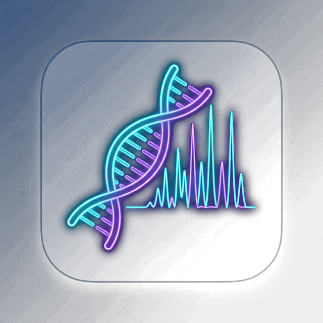
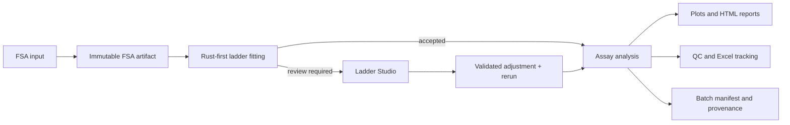
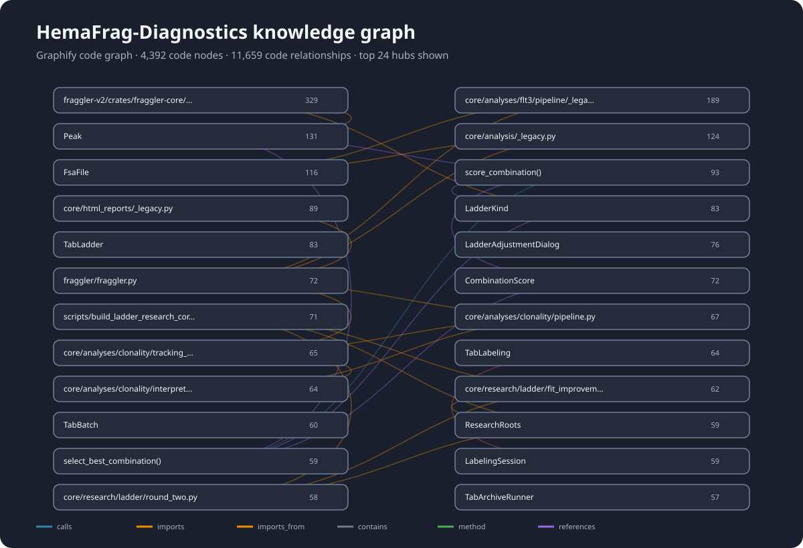

<p align="center">
  
</p>

<h1 align="center">HemaFrag Diagnostics</h1>

<p align="center">
  Offline-first fragment analysis, ladder quality control, review, and reporting in one desktop workflow.
</p>

<p align="center">
  
  
  
  
</p>

<p align="center">
  <a href="#quick-start">Quick start</a> ·
  <a href="#supported-workflows">Workflows</a> ·
  <a href="#safety-and-traceability">Safety</a> ·
  <a href="#development-and-testing">Development</a> ·
  <a href="packaging/README.md">Packaging</a>
</p>

> [!IMPORTANT]
> HemaFrag supports a controlled laboratory workflow. Raw clinical `.fsa` files, patient data, generated reports, and private validation corpora are deliberately excluded from this repository. Algorithm changes require local review and validation before operational use.

## Overview

HemaFrag Diagnostics is a Python/PyQt6 desktop application for processing fragment-analysis runs without requiring a cloud service. It combines assay-specific pipelines, Rust-accelerated ladder fitting, explicit quality gates, manual ladder review, batch manifests, and report generation.

| Area | Current implementation |
|---|---|
| Desktop interface | PyQt6 application with Clonality, FLT3, and General workflows |
| Numerical engine | Rust-first ladder fitting through an in-process ABI3 wheel, with explicit recovery routes |
| Review | Ladder Studio corrections, saved adjustment provenance, and manifest-based reruns |
| Outputs | HTML plots/reports, DIT summaries, QC output, and Excel tracking |
| Deployment | Source/Python installation or packaged desktop bundles for Windows, macOS, and Linux |
| Data handling | Offline-first; raw clinical data and generated artifacts stay outside Git |

## Why HemaFrag

- **Fast ladder fitting:** numerical kernels run through the Rust engine when available.
- **Peak-preserving preprocessing:** negative and drifting ladder traces are corrected without flattening diagnostic peaks.
- **No silent disappearance:** failed or ambiguous inputs retain a reason, manifest state, and review route.
- **Controlled correction:** manual ladder adjustments are validated, saved with provenance, and checked again when consumed by a rerun.
- **Complete batch reporting:** patient and QC entries are tracked explicitly through finalization.
- **Work-computer friendly:** the primary Windows source route supports Python 3.14 and the checked-in ABI3 wheel without requiring a local Rust toolchain.

## Workflow



## Supported workflows

### Clonality

- patient and PK/RK/NK control grouping;
- assay-specific peak analysis and interpretation;
- DIT, QC, and tracking output;
- in-app per-channel trace labeling backed by Excel-ready review data;
- explicit review handling for weak or rejected ladder fits.

ML models remain gated research candidates until their validation and promotion requirements pass. Candidate training does not silently replace the rule-based production result.

### FLT3

- GS500ROX/DATA4 ladder workflow by default;
- explicit LIZ/DATA105 override when configured;
- WT/mutant area ratio and base-pair difference;
- grouped ratio, TKD/D835, ITD, ITD 10×, and ITD 25× reporting;
- manual ladder-review and rerun support.

### General

- profile-driven ladder and trace configuration;
- support for non-patient identifiers;
- report generation without requiring a DIT-style patient number.

## Safety and traceability

HemaFrag treats quality and completeness as part of the analysis contract:

- ladder decisions carry engine, strategy, QC, and reason-code provenance;
- ambiguous cases become review entries instead of being discarded;
- strict Rust-only modes are available for validation and failure surfacing;
- valid manual adjustments are source-, ladder-, channel-, and assay-specific;
- batch manifests retain job membership, file hashes, stage state, outputs, and failure reasons;
- finalization checks expected patient and QC counts;
- writes to reports and tracking artifacts use guarded or atomic publication paths where supported.

The architecture and current engineering validation boundaries are documented in [Plan 15 — Architecture, Risk, Performance, and Stability Review](docs/plan15_architecture_risk_and_results.md).

## Quick start

### Windows with Python 3.14

The checked-in Windows wheel uses Python's stable ABI and is the preferred native-engine route on a work computer without a Rust toolchain.

```powershell
git clone https://github.com/Christian-Bjornstad/HemaFrag-Diagnostics.git
Set-Location HemaFrag-Diagnostics

py -3.14 -m venv .venv
.\.venv\Scripts\Activate.ps1
python -m pip install --upgrade pip
python -m pip install -r requirements.txt
python -m pip install .\wheels\fraggler_kernels-0.1.2-cp310-abi3-win_amd64.whl
python .\qt_app.py
```

If the computer already has an approved Python 3.14 environment, activate that environment and skip the virtual-environment creation step.

Verify the native wheel:

```powershell
python -c "import fraggler_native; print(fraggler_native.version, fraggler_native.is_available())"
```

Expected availability is `True`.

To create a desktop shortcut that uses the approved Python environment and the HemaFrag icon—without packaging another HemaFrag executable—run:

```powershell
powershell -ExecutionPolicy Bypass -File packaging\create_windows_shortcut.ps1 `
  -PythonPath "C:\path\to\approved-python-3.14\python.exe"
```

### macOS or Linux development

```bash
git clone https://github.com/Christian-Bjornstad/HemaFrag-Diagnostics.git
cd HemaFrag-Diagnostics

python3 -m venv .venv
source .venv/bin/activate
python -m pip install --upgrade pip
python -m pip install -r requirements.txt

cd fraggler-v2
cargo build --release -p fraggler-cli
cd ..
python qt_app.py
```

## Application navigation

| Page | Purpose |
|---|---|
| Run | Discover files, build deterministic jobs, run analysis, and publish reports |
| Ladder | Inspect review bundles, correct mappings, and rerun affected inputs |
| Archive Runner | Recover and continue prior manifest-backed review work |
| Log | Inspect application and analysis activity |
| Labeling | Review FSA plots, assign per-channel chemist labels, and save to Excel |
| Settings | Store analysis-specific paths and defaults, including master-sheet locations |
| About | Review the application identity, version, notices, and licenses |

## Development and testing

### AI-readable knowledge graph

[](docs/knowledge-graph.svg)

The repository can be indexed locally with [Graphify](https://github.com/Graphify-Labs/graphify). The graph above is a compact, GitHub-renderable overview of the most connected Python and Rust symbols. The full local graph remains untracked because it includes generated caches and can grow to tens of megabytes.

Install Graphify's current PyPI release once:

```bash
uv tool install graphifyy
graphify --version
```

Build the AI-queryable graph and interactive explorer from the repository root:

```bash
graphify extract . --code-only --no-viz
graphify cluster-only . --no-viz --no-label
graphify tree --graph graphify-out/graph.json \
  --output docs/knowledge-graph.html \
  --root . \
  --label HemaFrag-Diagnostics \
  --max-children 100
python scripts/render_knowledge_graph.py
```

Open `docs/knowledge-graph.html` locally for the interactive tree. Query the full graph directly for AI-assisted navigation:

```bash
graphify query "How does ladder fitting reach report generation?"
graphify explain "FsaFile"
graphify path "FsaFile" "LadderAdjustmentDialog"
graphify affected "LadderKind" --depth 3
```

After source changes, refresh the deterministic code graph and both views:

```bash
graphify update .
graphify cluster-only . --no-viz --no-label
graphify tree --graph graphify-out/graph.json --output docs/knowledge-graph.html --root . --label HemaFrag-Diagnostics --max-children 100
python scripts/render_knowledge_graph.py
```

GitHub renders SVG in a README but does not run the JavaScript used by an interactive HTML graph. Therefore the README embeds the committed SVG and links to the local HTML file. To host the interactive explorer in a browser, publish `docs/knowledge-graph.html` with GitHub Pages or attach it as a workflow artifact.

Run the complete Python suite:

```bash
python -m pytest -q
```

Run the Rust workspace tests and checks:

```bash
cd fraggler-v2
cargo test --workspace --all-targets
cargo check -p fraggler-kernels-py
```

Run the repeatable non-clinical startup/baseline benchmark:

```bash
python scripts/benchmark_plan15_runtime.py \
  --startup-repeats 5 \
  --arpls-repeats 10 \
  --output validation_outputs/plan15_runtime.json
```

Synthetic benchmarks do not replace review against the private real-FSA validation corpus.

## Desktop packaging

All desktop builds use `qt_app.py` as the canonical entry point and `build_qt.py` as the shared PyInstaller contract.

| Platform | Build command | Release output |
|---|---|---|
| Windows | `packaging\build_windows.bat` | `dist/releases/HemaFrag_Windows.zip` |
| macOS | `./packaging/build_mac.sh` | `dist/releases/HemaFrag_macOS.zip` |
| Linux | `./packaging/build_linux.sh` | `dist/releases/HemaFrag_Linux_offline.zip` |

See the [desktop packaging guide](packaging/README.md) for platform assumptions, offline deployment, icon behavior, and troubleshooting.

## Repository structure

```text
HemaFrag-Diagnostics/
├── core/              Analysis pipelines, manifests, reporting, and provenance
├── fraggler/          Legacy-compatible Python scientific helpers
├── fraggler-v2/       Rust workspace and PyO3 native engine
├── gui_qt/            Primary PyQt6 desktop interface
├── assets/            Application icons and bundled report assets
├── packaging/         Cross-platform build and deployment tooling
├── scripts/           Benchmarks, validation, training, and maintenance tools
├── tests/             Python regression and workflow tests
├── wheels/            Verified native wheel for the Windows source deployment
├── docs/              Architecture, ML, and ladder-fitting documentation
└── ObsidianVault/     Project memory, decisions, session log, and open items
```

Contributors should begin with [ObsidianVault/00_Start_Here.md](ObsidianVault/00_Start_Here.md) before changing diagnostic logic or operational contracts.

## Data and generated files

The following stay outside version control:

- raw `.fsa` files and clinical datasets;
- patient identifiers and generated clinical reports;
- private validation corpora and local benchmark outputs;
- `artifacts/`, `local_triage/`, review bundles, and scratch output;
- Python caches, `build/`, `dist/`, and Rust `target/` directories;
- local runtime binaries except explicitly distributed release artifacts.

## Further documentation

- [Architecture, risk, performance, and stability review](docs/plan15_architecture_risk_and_results.md)
- [Clinical Workbench design](docs/superpowers/specs/2026-08-12-hemafrag-clinical-workbench-design.md)
- [Clinical Workbench implementation plan](docs/superpowers/plans/2026-08-12-hemafrag-clinical-workbench.md)
- [Clonality ML interpretation design](docs/ml-clonality-interpretation.md)
- [Rust ladder-fitting plan](docs/ladder-fitting-rust-plan.md)
- [Desktop packaging guide](packaging/README.md)
- [Windows source-transfer guide](packaging/WINDOWS_TRANSFER_README.md)
- [Project memory and working agreements](ObsidianVault/00_Start_Here.md)

## Third-party notices

The Python compatibility layer in `fraggler/` is derived from the upstream Fraggler project. Its MIT notice is retained in [LICENSES/fraggler_MIT.txt](LICENSES/fraggler_MIT.txt).
